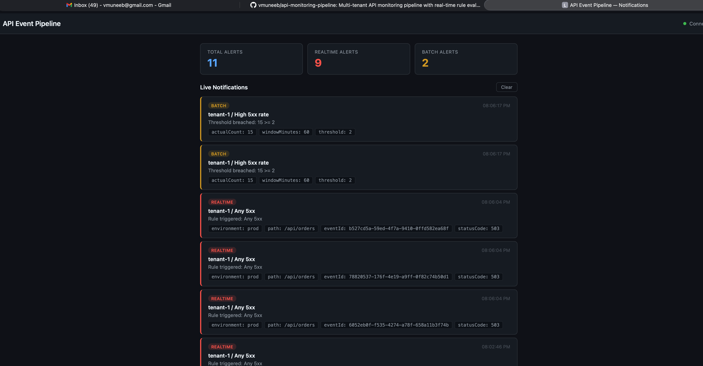

# API Monitoring Pipeline

A multi-tenant API event monitoring pipeline built with Spring Boot. Ingests HTTP API events, evaluates configurable rules in real-time and batch modes, and delivers notifications through a live dashboard.

## Architecture

```
                         ┌──────────────────────────────────────────────────┐
                         │                Spring Boot App                   │
                         │                                                  │
  POST /api/v1/events    │  ┌──────────────┐     ┌───────────────────────┐  │
 ───────────────────────►│  │  Ingestion   │───► │     EventBus          │  │
   (X-Tenant-Id header)  │  │  Controller  │     │  (LinkedBlockingQueue)│  │
                         │  └──────────────┘     └──────┬──────┬─────────┘  │
                         │                              │      │            │
                         │              ┌──────────────-┘      └──────┐     │
                         │              ▼                            ▼      │
                         │  ┌──────────────────┐      ┌──────────────────┐  │
                         │  │ Realtime Workers  │      │  Batch Writer    │ │
                         │  │ (thread pool)     │      │  (scheduled)     │ │
                         │  └────────┬─────────┘      └────────┬─────────┘  │
                         │           │                          │           │
                         │           ▼                          ▼           │
                         │  ┌──────────────────┐      ┌──────────────────┐  │
                         │  │ Rule Evaluator    │      │  JSONL Files    │  │
                         │  │ (per-event)       │      │  (partitioned)  │  │
                         │  └────────┬─────────┘      └────────┬─────────┘  │
                         │           │                          │           │
                         │           │                          ▼           │ 
                         │           │                ┌──────────────────┐  │
                         │           │                │ Batch Aggregator │ │
                         │           │                │ (DuckDB COUNT(*))│ │
                         │           │                └────────┬─────────┘ │
                         │           ▼                         ▼          │
                         │  ┌──────────────────────────────────────────┐  │
                         │  │         Notification Service             │  │
                         │  │    (log + in-memory buffer + SSE)        │  │
                         │  └──────────────────┬───────────────────────┘  │
                         │                     │                          │
                         └─────────────────────┼──────────────────────────┘
                                               ▼
                                    ┌────────────────────┐
                                    │   Live Dashboard   │
                                    │  (localhost:8080)  │
                                    └────────────────────┘
```

**Two processing modes:**

- **Realtime** — each event is evaluated against enabled REALTIME rules as it arrives. Matching rules fire notifications immediately.
- **Batch** — events are written to partitioned JSONL files. A scheduled job runs DuckDB `COUNT(*)` queries with rule-defined WHERE clauses and thresholds over a configurable time window.

**Key design decisions:**

- Single-table rule model with nullable batch fields (`windowMinutes`, `countThreshold`) — keeps persistence and API simple; type safety via `RuleType` enum.
- **Production-swappable abstractions** — core infrastructure components are coded to interfaces, not implementations. The in-memory defaults are intentionally simple for a self-contained demo, but each can be replaced independently without changing business logic:

  | Abstraction | Current Implementation | Production Replacement |
  |---|---|---|
  | `EventBus` | `InMemoryEventBus` (LinkedBlockingQueue) | Kafka, AWS SQS, RabbitMQ |
  | `NotificationService` | `LoggingNotificationService` (console + SSE) | PagerDuty, Slack, webhooks |
  | Batch storage | JSONL files on local disk | S3/GCS + Parquet/Iceberg |
  | Batch aggregation | DuckDB over JSONL | Spark, Flink, or Trino over a data lake |
  | Rule DB | H2 in-memory | PostgreSQL, MySQL |

- Two-level AND/OR condition logic (condition groups joined by a top-level operator, conditions within each group joined by the group's operator).

## Prerequisites

- **Java 17** 
- **Maven 3.8+**

## Build

```bash
mvn clean compile
```

## Run Tests

```bash
mvn clean test
```

## Package & Run

```bash
mvn clean package -DskipTests
java -jar target/api-event-pipeline-0.0.1-SNAPSHOT.jar
```

The app starts on `http://localhost:8080`. The notification dashboard is served at the root URL.



To override defaults for faster manual testing:

```bash
java -jar target/api-event-pipeline-0.0.1-SNAPSHOT.jar \
  --pipeline.batch.flush-interval-ms=5000 \
  --pipeline.batch.aggregation-interval-ms=15000
```

## Manual Testing

See [HOW_TO_TEST.md](HOW_TO_TEST.md) for step-by-step curl commands to exercise:

1. Realtime rule evaluation and notifications
2. Batch event storage (JSONL files)
3. Batch aggregation with DuckDB threshold alerts
4. Live notification dashboard

## API Endpoints

| Method | Path | Description |
|--------|------|-------------|
| POST | `/api/v1/events` | Ingest an event (requires `X-Tenant-Id` header) |
| POST | `/api/v1/tenants/{tenantId}/rules` | Create a rule |
| GET | `/api/v1/tenants/{tenantId}/rules` | List rules (optional `?type=` and `?enabled=` filters) |
| GET | `/api/v1/tenants/{tenantId}/rules/{id}` | Get a rule |
| PUT | `/api/v1/tenants/{tenantId}/rules/{id}` | Update a rule |
| DELETE | `/api/v1/tenants/{tenantId}/rules/{id}` | Delete a rule |
| PATCH | `/api/v1/tenants/{tenantId}/rules/{id}/enable` | Enable a rule |
| PATCH | `/api/v1/tenants/{tenantId}/rules/{id}/disable` | Disable a rule |
| GET | `/api/v1/notifications` | Recent notifications (JSON) |
| GET | `/api/v1/notifications/stream` | Live notification stream (SSE) |

## Assumptions and Trade-offs

- **Single-process deployment** — the realtime workers, batch writer, and batch aggregator all run inside one JVM. This simplifies the demo but means scaling each component independently requires extracting them into separate services.
- **In-memory event bus with bounded queues** — the realtime queue drops events when full (back-pressure via `offer`), while the batch queue blocks the publisher (`put`). This favors batch completeness over realtime guarantees, which is the right trade-off for monitoring (you'd rather drop a real-time alert than lose data for aggregate analysis).
- **No event deduplication** — the pipeline assumes each ingested event is unique. In production, idempotency keys and deduplication at the bus layer (e.g., Kafka consumer offsets) would handle retries.
- **Batch rules re-fire each cycle** — there is no cool-down tracking, so a breached threshold will fire again on the next aggregation run until the window moves past the offending events. Acceptable for a demo; production would track `lastFiredAt` per rule.
- **DuckDB runs in-process** — each aggregation cycle opens a fresh in-memory DuckDB connection and scans JSONL files directly. This works well for moderate data volumes but would be replaced by a persistent query engine (Spark/Trino) at scale.
- **H2 in-memory database** — rules are lost on restart. The schema is designed for PostgreSQL compatibility (`MODE=PostgreSQL`) so switching is a config change.
- **Flat JSONL schema** — nested event fields (headers, tags) are not written to batch files. This keeps the DuckDB queries simple but limits what batch rules can filter on. Extending the schema is straightforward.

## What I Would Improve in V2

- **Persistent event store** — replace JSONL with Parquet or Iceberg for efficient columnar queries at scale.
- **Metadata catalog** — add a catalog database (e.g., AWS Glue, Hive Metastore, or Nessie) to track Iceberg table snapshots, partition stats, and schema evolution per tenant — replacing the current filesystem-based partition discovery with proper metadata-driven query planning.
- **Production message bus** — swap `LinkedBlockingQueue` with Kafka for durability, backpressure, and horizontal scaling.
- **Notification channels** — plug in Slack, PagerDuty, or webhook destinations behind the `NotificationService` interface.
- **Batch cool-down** — track last-fired timestamp per rule to suppress repeated threshold notifications.
- **Rule versioning** — audit trail for rule changes with effective-from timestamps.
- **Auth & tenant isolation** — API key or JWT-based authentication with tenant-scoped access control.
- **Observability** — Prometheus metrics for queue depths, rule evaluation latency, and notification delivery rates.
